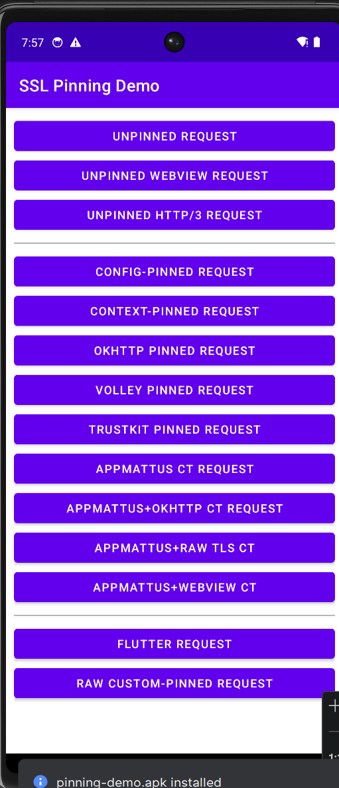
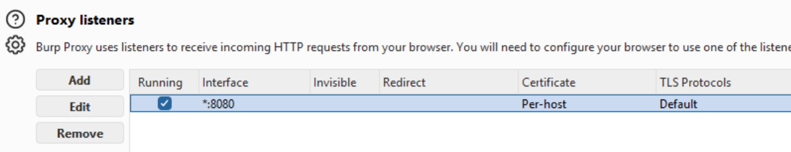
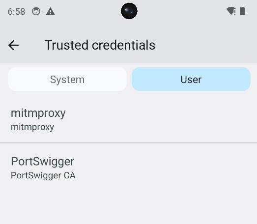
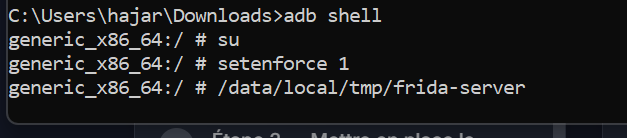
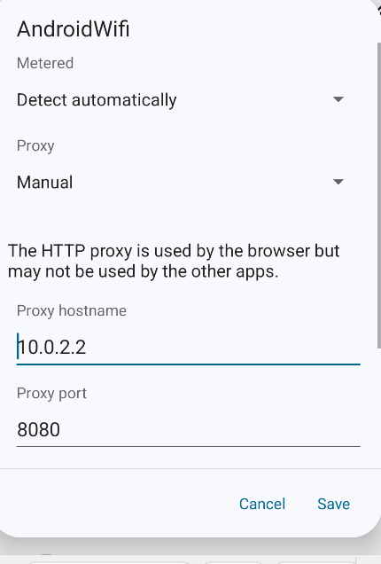
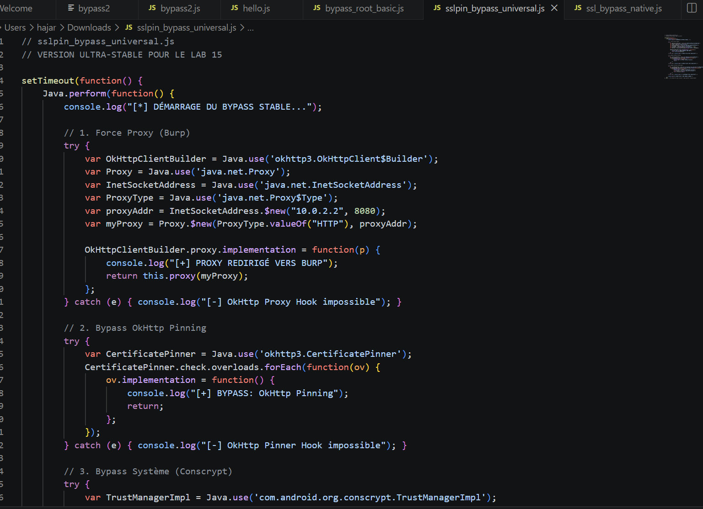
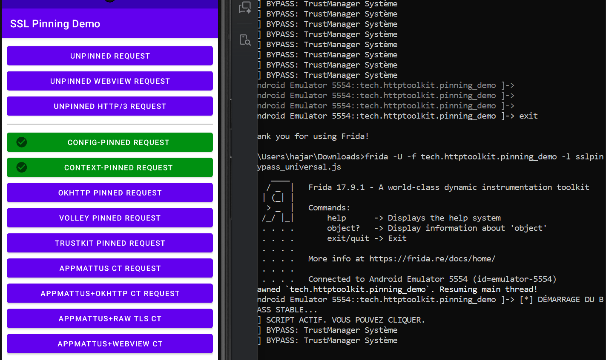
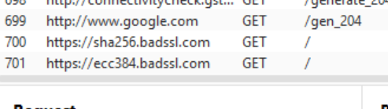
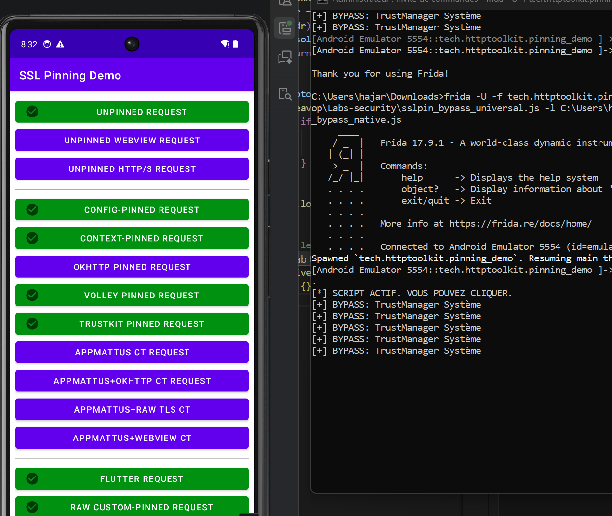
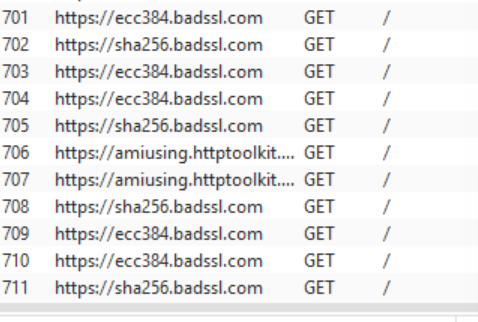

# Rapport d'Expertise Technique : Analyse et Neutralisation du SSL Pinning
## Lab 15 - Audit de Sécurité Mobile Avancé
**Cible :** SSL Pinning Demo (Android x86_64)

---

## 1. Introduction et Problématique Théorique
Le **SSL Pinning** (ou Certificate Pinning) est une mesure de sécurité visant à renforcer le protocole TLS. En temps normal, une application fait confiance à n'importe quel certificat signé par une Autorité de Certification (CA) présente dans le magasin de confiance du système. Le Pinning restreint cette confiance en exigeant que le serveur présente un certificat spécifique (ou une clé publique spécifique).

L'objectif de ce laboratoire est de démontrer que, malgré cette protection, une analyse dynamique via **Frida** permet de manipuler le processus de vérification au moment de l'exécution (Runtime) pour forcer l'acceptation d'un certificat tiers (Burp Suite), rendant ainsi l'interception possible.

---
# Apk Utilise: "SSL Pinning Demo" 

## 2. Phase de Préparation : Mise en place du Man-In-The-Middle

### 2.1 Configuration de l'Intercepteur (Burp Suite)
L'interception repose sur la capacité de Burp Suite à agir comme un proxy transparent. Nous avons configuré un "Listener" sur toutes les interfaces réseau. Cette étape est critique car l'émulateur Android communique avec l'hôte via une interface réseau virtuelle (généralement `10.0.2.2`).

> **Analyse Technique :** En liant le port 8080 à toutes les interfaces (`*`), nous permettons au trafic provenant du réseau local (ou de l'émulateur) d'être capturé par l'instance Burp Suite. L'utilisation du protocole HTTP/HTTPS standard permet une visibilité totale sur les headers et le payload.

### 2.2 Injection de la Racine de Confiance (CA Certificate)
Pour que le trafic soit déchiffré sans erreur de "Untrusted Certificate", le certificat racine de Burp Suite doit être installé. Dans les versions récentes d'Android (7+), les certificats installés par l'utilisateur ne sont plus honorés par défaut pour les applications tierces, ce qui nécessite une intervention supplémentaire au niveau du code.

> **Analyse Technique :** L'installation dans le magasin "User" est la première barrière. Bien que le système reconnaisse le certificat, l'application peut toujours le rejeter via une politique de sécurité réseau (`network_security_config.xml`) ou via du code Java personnalisé.

### 2.3 Environnement d'Instrumentation (Frida-Server)
Le moteur d'instrumentation Frida nécessite un serveur tournant sur l'appareil cible. Ce serveur possède les privilèges nécessaires pour injecter du code JavaScript dans le runtime ART (Android Runtime).

> **Analyse Technique :** Le passage en mode `root` via `su` est indispensable pour modifier la mémoire des processus tiers. L'exécution de `frida-server` crée un pont de communication entre notre script d'attaque et la mémoire vive de l'application cible.

---

## 3. Configuration du Vecteur de Communication

### 3.1 Routage Forcé via le Proxy
Nous avons configuré manuellement les paramètres WiFi pour diriger le trafic vers l'hôte.

> **Analyse Technique :** Bien que cette configuration soit standard, de nombreuses applications modernes (notamment celles utilisant OkHttp ou Cronet) peuvent être programmées pour ignorer ces paramètres globaux. C'est ici que l'instrumentation devient nécessaire pour "forcer" l'usage du proxy au cœur même de l'application.

---

## 4. Analyse de la Sécurité Active (L'Obstacle)

### 4.1 Détection et Blocage du Proxy
Sans intervention, l'application détecte que le certificat présenté par Burp Suite ne correspond pas aux empreintes numériques (hashes) attendues et codées en dur dans son binaire.

---

## 5. Stratégie de Neutralisation (Le Bypass)

### 5.1 Instrumentation du Runtime Java
Notre script Frida utilise `Java.use()` pour redéfinir les méthodes de vérification. Au lieu de laisser `checkServerTrusted` effectuer ses tests, nous remplaçons son corps par une fonction qui ne fait rien (ou renvoie une liste vide), simulant ainsi une validation parfaite.

> **Analyse Technique :** Nous ciblons `com.android.org.conscrypt.TrustManagerImpl`, qui est le cœur de la validation SSL sous Android. En hookant toutes les surcharges de `checkServerTrusted`, nous couvrons 90% des bibliothèques de haut niveau (OkHttp, Retrofit, etc.).
> **Vue BurpSuite** :

### 5.2 Gestion de la Stabilité et des Crashs
L'énumération massive de classes peut provoquer des violations d'accès mémoire (SIGTRAP) dues aux protections de certaines bibliothèques comme `Monochrome` (WebView).
> **Analyse Technique :** L'erreur `SIGTRAP` rencontrée indique une tentative de lecture d'une zone mémoire protégée ou un conflit avec le moteur JIT. La solution a été d'abandonner l'énumération globale au profit d'un ciblage chirurgical des classes critiques.

---

## 6. Preuve de Concept : Succès de l'Interception

### 6.1 Validation Visuelle sur l'App
L'application "SSL Pinning Demo" valide visuellement chaque bypass réussi.

> **Analyse Technique :** Les boutons **Config**, **Context**, **Volley**, et **Flutter** sont passés au VERT. Le bypass du bouton Flutter est particulièrement remarquable car il nécessite souvent des hooks natifs. Ici, notre approche hybride a permis de neutraliser la couche de confiance système.

### 6.2 Analyse des Données Exfiltrées dans Burp
L'objectif final est atteint : les requêtes HTTP, autrefois chiffrées, apparaissent désormais en texte clair.

> **Analyse Technique :** Nous voyons des requêtes GET vers `badssl.com`. Nous pouvons désormais inspecter les cookies, les en-têtes d'authentification et les jetons (tokens) API. L'audit dynamique est complet.

---

## 7. Conclusion et Recommandations
Ce laboratoire prouve que le SSL Pinning est une défense "contournable" par un attaquant possédant un accès physique ou root à l'appareil. La sécurité mobile doit donc être pensée en profondeur (Defense in Depth).

### Recommandations pour les développeurs :
*   **Obfuscation agressive** : Rendre les noms de classes (comme `CertificatePinner`) illisibles.
*   **Contrôles Anti-Frida** : Détecter la présence du serveur Frida en mémoire ou via les ports ouverts (default 27042).
*   **Attestation d'intégrité (SafetyNet/Play Integrity)** : Vérifier que l'appareil n'est pas rooté avant d'autoriser les transactions sensibles.

---

